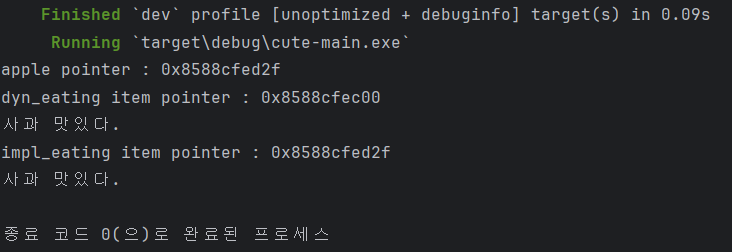
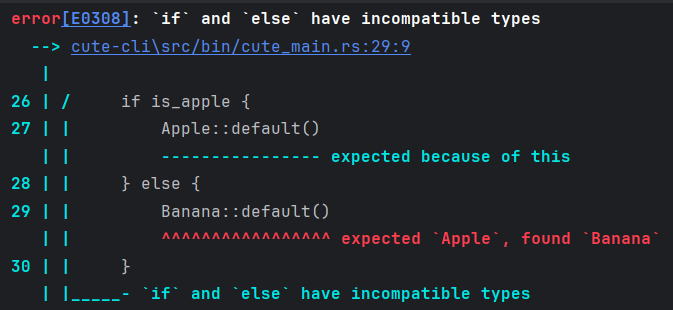
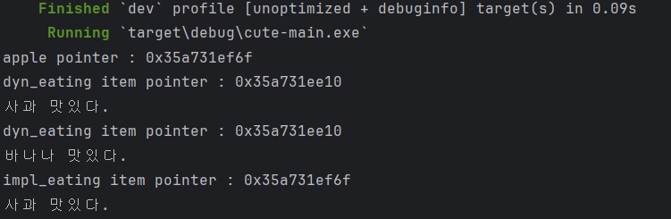
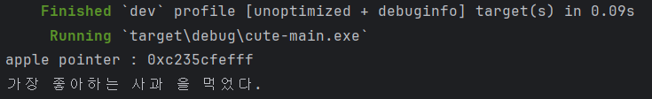

# Trait 이란?
다른언어에서 정의하는 Interface 와 유사함.

## 특성 정의 및 구현
다른언어에서의 특성 정의와 동일하다. 아래는 예제와 같다.
```rust
use std::io::Error;

pub trait Fruit {
    fn eat(&self) -> Result<(), std::io::Error>;
}
#[derive(default)]
pub struct Apple;

impl Fruit for Apple {
    fn eat(&self) -> Result<(), Error> {
        println!("사과 맛있다.");
        Ok(())
    }
}

fn main() {
    let apple = Apple::Default();
    if let Ok(_) = apple.eat() {
    }
}

```

## 기본 구현.
다른 언어에서의 virtual 와의 작동 방식이 동일하다. 그러나 이것은 interface 와 같이 여러개을 붙일 수 있으나
c# 같은 언어는 interface 를 제외하면 1개만 상속이 가능하기에 차이점이 존재한다.
```rust
use std::io::Error;

pub trait Fruit {
    fn eat(&self) -> Result<(), std::io::Error> {
        Ok(())
    }
}
#[derive(default)]
pub struct Apple;

impl Fruit for Apple {
    /* 따로 구현해도 됨.
    fn eat(&self) -> Result<(), Error> {
        todo!()
    }
     */
}

fn main() {
    let apple = Apple::Default();
    if let Ok(_) = apple.eat() {
    }
}
```

## 매개 변수 및 Generic 으로 사용 + 특성 지정
특성 지정이라고 하는것은 해당 Generic 또는 Trait 에 다양한 특성을 지정한다.

특성을 지닌다고 하는것은 해당 요소를 보장한다는 말이다. 보장을 하기위해서 기본 객체는 해당 특성을 가지고 있어야 한다.

특성(보장)에 대한 종류 예시는 아래와 같다.
+ [Send, Sync](https://doc.rust-lang.org/nomicon/send-and-sync.html)
+ [Default](https://doc.rust-lang.org/std/default/trait.Default.html)
+ [Debug](https://doc.rust-lang.org/std/fmt/trait.Debug.html)
+ [Clone](https://doc.rust-lang.org/std/clone/trait.Clone.html)
+ [Copy](https://doc.rust-lang.org/std/marker/trait.Copy.html)
+ 기타 등등

2가지의 방식중 하나를 사용한다.

### &Impl T
+ Compile 시에 해당 타입이 무조건 고정 및 Sized 가 보장 되어있으며 성능이 중요할때 사용.
+ 추가적인 Memory 할당을 하지 않고 Stack 메모리를 사용 하는 경우
+ 소유권 이동을 하고 싶지 않음.

### Box<dyn T>
+ Compile 시에는 유연히 대처하며 Runtime 시에 다양한 T 에 대응해야 할 떄 사용.
+ Trait 객체를 통해 타입 크기 (Sized 가 보장)를 균일하게 관리할 떄 사용.
+ 소유권 이동이 필요한 경우

예시 및 결과는 아래와 같다.
```rust
pub trait Fruit {
    fn eat(&self) -> Result<(), std::io::Error>;
}
#[derive(Default)]
pub struct Apple;

impl Fruit for Apple {
    fn eat(&self) -> Result<(), std::io::Error> {
        println!("사과 맛있다.");
        Ok(())
    }
}

fn dyn_eating(item : Box<dyn Fruit>) -> Result<(), std::io::Error> {
    println!("dyn_eating item pointer : {:p}", &item);
    item.eat()
}

fn impl_eating(item :  &impl Fruit) -> Result<(), std::io::Error> {
    println!("impl_eating item pointer : {:p}", item);
    item.eat()
}
#[tokio::main]
async fn main() -> Result<(), std::io::Error> {
    let apple = Apple::default();
    println!("apple pointer : {:p}", &apple);
    dyn_eating(Box::new(Apple::default()))?;
    impl_eating(&apple)?;
    Ok(())
}
```


## 반환
Trait 은 parameter 처럼 사용도 가능하지만 특정 함수에 대한 반환 값으로도 사용 될 수 있습니다.

반환시에도 특성 지정이 가능합니다. 2가지 방식인 `Box<dyn T>` 또는 `impl T` 가 가능하나 `impl T`의 경우 아래의 제한사항이 있습니다.
+ 단일 유형을 반환해야 합니다.
+ 생존 주기 (수명) 이 명시되어야 합니다.

예시는 다음과 같다. 이때 `fn impl_create_fruit(is_apple : bool) -> impl Fruit` 함수는 아래와 같은 에러가 발생한다.
```rust
pub trait Fruit {
    fn eat(&self) -> Result<(), std::io::Error>;
}
#[derive(Default)]
pub struct Apple;

impl Fruit for Apple {
    fn eat(&self) -> Result<(), std::io::Error> {
        println!("사과 맛있다.");
        Ok(())
    }
}

#[derive(Default)]
pub struct Banana {
    len : usize
}
impl Fruit for Banana {
    fn eat(&self) -> Result<(), std::io::Error> {
        println!("바나나 맛있다.");
        Ok(())
    }
}
/*
fn impl_create_fruit(is_apple : bool) -> impl Fruit {
    if is_apple {
        Apple::default()
    } else {
        Banana::default()
    }
}
*/

fn dyn_create_fruit(is_apple : bool) -> Box<dyn Fruit> {
    if is_apple {
        Box::new(Apple::default())
    } else {
        Box::new(Banana::default())
    }
}

fn dyn_eating(item : Box<dyn Fruit>) -> Result<(), std::io::Error> {
    println!("dyn_eating item pointer : {:p}", &item);
    item.eat()
}

fn impl_eating(item :  &impl Fruit) -> Result<(), std::io::Error> {
    println!("impl_eating item pointer : {:p}", item);
    item.eat()
}
#[tokio::main]
async fn main() -> Result<(), std::io::Error> {
    let apple = Apple::default();
    println!("apple pointer : {:p}", &apple);
    dyn_eating(dyn_create_fruit(true))?;
    dyn_eating(dyn_create_fruit(false))?;
    impl_eating(&apple)?;
    Ok(())
}
```


에러가 일어나는 구현부분을 제거후 동작시 아래와 같이 정상적 동작을 함을 확인 할 수 있다.


## SuperTrait
상속과 유사하지만 상위 요소들을 해당 자식 trait 에서 가져다 쓸 수 있다. 

Food <- Fruit <- FavoriteFruit 로 이루어진 Trait 이다.

예제는 아래와 같다.
```rust
pub trait Food {
    fn name(&self) -> String;
}

pub trait Fruit : Food {
    fn eat(&self) -> String {
        String::from("먹었다.")
    }
}

pub trait FavoriteFruit : Fruit{
    fn favorite(&self) -> Result<(),std::io::Error> {
        println!("가장 좋아하는 {} 을 {}",self.name(),self.eat());
        Ok(())
    }
}

#[derive(Default)]
pub struct Apple;
impl Food for Apple {
    fn name(&self) -> String {
        String::from("사과")
    }
}
impl Fruit for Apple {}
impl FavoriteFruit for Apple {}

#[tokio::main]
async fn main() -> Result<(), std::io::Error> {
    let apple = Apple::default();
    println!("apple pointer : {:p}", &apple);
    apple.favorite()?;
    Ok(())
}
```
