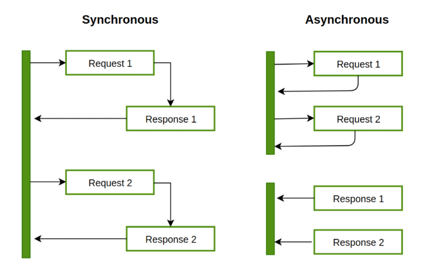

# 동기, 비동기
동기와 비동기에 대한 Markdown 을 작성하였다.


## 동기의 간단한 설명
1개의 Executor 당 N 개의 일이 존재한다면 N 개의 일이 순서대로 진행이 되어야 한다.

이전의 작업이 완료가 되어야 현재의 작업을 진행 할 수 있다. 이때 작업의 수행하는 주체는 Executor 이다.

## 비동기의 간단한 설명
1개의 Executor 당 N 개의 일이 존재한다면 N 개를 순서대로 예약처리를 진행한다.

즉 이전의 작업이 완료되지 않아도 예약처리를 진행하였기 떄문에 다음 예약처리를 진행한다.

이때 작업을 수행하는 주체는 Executor 가 아니라 예약을 관장하는 비동기 런타임 (스케쥴러 + 이벤트 루프) 이다.

### Event Loop
```rust
pub trait Future {
    type Output;

    // 비동기 작업의 상태를 확인하는 메서드
    fn poll(self: Pin<&mut Self>, cx: &mut Context<'_>) -> Poll<Self::Output>;
}
```
작업을 기다리면서 Blocking 하지 않고 다른작업을 실행하게 해준다. 이것은 Rust-lang 의 Future Trait 에서 볼 수 있다.

내부적으로 poll 함수를 통해 작업을 계속적으로 검사합니다. 

이때 `Poll::Pending` 인지 `Poll::Ready(T)` 인지를 계속적으로 Loop 를 수행하며 검사합니다.

`await` 를 수행한다는것은 검사 시 상태가 `Poll::Ready(T)` 인 경우 반환 받겟다를 의미합니다.

### 스케쥴러
스케쥴러는 비동기 작업들이 언제, 어떻게 실행될지를 결정하는 요소이다. 스케쥴러는 Multi Thread 에 분배하거나 단일 Thread 에 분배한다.

그렇게 분배된 것은 Rust-lang 에서는 Thread Pool 에서 관리하며 여러 비동기 작업을 동시에 처리하도록 도와줍니다.

### 비동기와 multi thread 의 차이
[https://www.baeldung.com/cs/async-vs-multi-threading](https://www.baeldung.com/cs/async-vs-multi-threading)

multi thread 는 CPU 에 의존적인 작업 및 Processor 에 의해 작업 공간이 생기고 해당 작업 공간에서 격리되어 작동한다. 격리된 요소에서 공유를 위해 Mutex 등이 사용된다.

비동기의 경우 CPU 에 의존적이지는 않다. CPU 에서 작업을 수행할 필요가 없는 경우 비동기 런타임이 동작하여 작업을 수행할 수 있다.

쉽게 말하면 thread 는 CPU 작업자로 고정, 비동기는 작업을 외주 던지는 느낌이다. 비동기의 외주 작업자는 언어별 비동기 런타임에 의해 결정된다.

이부분은 공부를 더하도록 하겠다.


