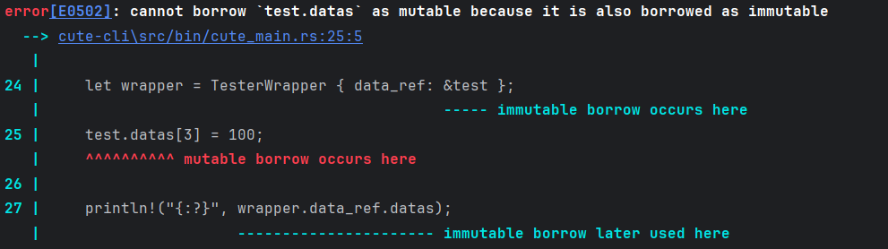
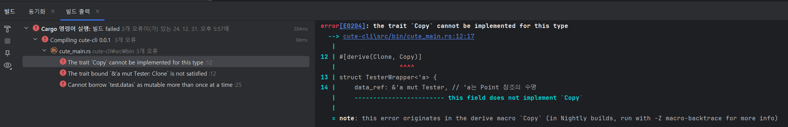

# Clone 와 Copy
그냥 단어만 보면 하나는 Clone , Copy 거의 동일한 말인데 무엇이 차이가 나는것인가?

# Copy
암묵적으로 명시하지 않고 값을 복제하는 경우 사용 합니다.

Copy 의 경우 Clone 이 SuperTrait (부보) 로 걸려있기에 Copy 하기 위해서는 Clone 이 보장되어야 합니다.

아래의 경우 사용가능함
+ 메모리에서 Stack 에 데이터 저장하는 요소.
+ Bit 단위로 복사 가능한 요소. Compile Time 에 정확한 크기 확인 가능한 요소.
+ 얕은 복사가 가능한 요소.

그러나 아래의 예외상황이 존재 합니다.
+ 생존주기(수명) 이 명시적으로 되어 있는 공유 참조의 경우 Copy 가능.
+ Copy Trait 을 명시적으로 구현하는 경우 재정의 불가능.

예시는 아래와 같습니다
```rust
/// 해당 요소의 경우 Copy 가 불가능함.
///
/// Tester 내의 datas 는 이미 heap 영역에 저장되었으며 동적으로 크기 변경이 되기때문에 Copy 사용 x.
#[derive(Clone, Default)]
struct Tester {
    datas : Vec<i32>,
}

///'a 의 경우 Tester 의 생존주기(수명) 을 의미함.
/// 
/// 참조된 요소를 수정 하는것은 불가능 하나 나머지 작업은 가능함.
#[derive(Clone, Copy)]
struct TesterWrapper<'a> {
    data_ref: &'a Tester, // 'a는 Point 참조의 수명
}

fn main() {
    println!("Hello, world!");

    let test = Tester {
        datas: vec![1, 2, 3, 4, 5],
    };

    let wrapper = TesterWrapper { data_ref: &test };

    println!("{:?}", wrapper.data_ref.datas);
}
```
어? 그러면 test 는 mut 하게 하면 문제 없지 않겟나 하고 시도 해보는 것들은 다음과 같다.

1. test 지역변수를 mut 하게 하고 변경해보기.
    - wrapper 를 선언하기 이전이라면 문제가 될 것은 없다.
    - 그러나 TestWrapper 를 사용한 이후라면 mutable 로 선언했더라도 빌린 요소는 이미 변경할수 없는 상태이므로 Error 발생.
```rust
fn main() {
    println!("Hello, world!");

    let mut test = Tester {
        datas: vec![1, 2, 3, 4, 5],
    };
    
    let wrapper = TesterWrapper { data_ref: &test };
    test.datas[3] = 100;
    println!("{:?}", wrapper.data_ref.datas);
}
```


2. 그렇다면 공유 참조된 요소도 mutable 시키면 되는거 아님? 으로 접근하고 하면
   - Copy Trait 에 위배된다. 
   - 이미 빌린 요소를 한번더 빌리는 경우 Compiler 가 안전하지 않다고 판단.
```rust
///'a 의 경우 Tester 의 생존주기(수명) 을 의미함.
///
/// 참조된 요소를 수정 하는것은 불가능 하나 나머지 작업은 가능함.
#[derive(Clone, Copy)]
struct TesterWrapper<'a> {
   data_ref: &'a mut Tester, // 'a는 Point 참조의 수명
}

#[tokio::main]
async fn main() {
   println!("Hello, world!");

   let mut test = Tester {
      datas: vec![1, 2, 3, 4, 5],
   };
   let wrapper = TesterWrapper { data_ref: &mut test };
   test.datas[3] = 100;

   println!("{:?}", wrapper.data_ref.datas);
}
```


이를 통해 Copy Trait 의 제한사항 및 Compiler Error 를 확인할 수 있었다.

# Clone
객체를 명시적으로 명확하게 복제 합니다. 깊은 복사와 동일합니다.

깊은 복사의 경우 Internet 검색을 수행하시면 이것보다 더 좋은 자료들이 많이 나옵니다.

아래의 예외상황이 존재 합니다.
+ Clone Trait 을 명시적으로 구현하는 경우 재정의가 가능하다. 객체의 타입만 동일하게 하여 새로운 객체를 생성하는것과 같기 때문.


