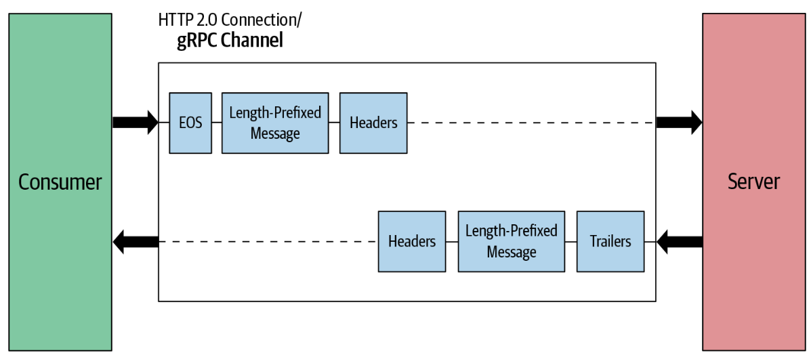

# GRPC
구글에서 개발한 고성능 OpenSource RPC Framework 이다.

사용하는 전송 프로토콜은 HTTP2 를 사용하며 IDL 은 [protobuf](https://protobuf.dev/) 를 사용한다. 아래에서는 IDL 및 RPC , gRPC 에 대해 기술한다.


## IDL
인터페이스(`I`nterface) 정의(`D`efinition) 언어(`L`anguage) 의 약자이다. 해당 정의 언어를 통해 서로 다른 언어 및 Application 와의

의사소통을 가능하게 해주는 전송 형식이다.

```protobuf
message Person {
  string name = 1;
  int32 id = 2;
  bool has_ponycopter = 3;
}
```
위와 같이 구성을 하고 해당 언어로 IDL 을 컴파일 하는 경우 해당 사용언어로 Compile 되어 반환된다.

## RPC
원격(`R`emote) 프로시저(`P`rocedure) 호출(`C`all) 의 약자이다. 별도의 제어 없이 다른 주소 공간에 함수 및 프로시저를 실행 할 수 있게 해주는
통신 기술이다.

이때 함수는 우리가 어릴때 알던 네모 박스에 Input 을 넣으면 Output 이 반환되는 것을 함수라고 한다.

프로시저는 명령들이 수행되는 절차라 보시면 된다.

RPC 통신 방법은 아래와 같다.


1. IDL 에 맞는 각 Compiler 를 통해 각 언어에 맞는 Stub 및 직/역직렬화 코드 생성
2. Client 및 Server 측에서는 각 함수 및 프로시저에 해당하는 코드 작성
3. Client 에서 해당 함수 또는 프로시저 호출 및 함수 호출에 맞는 데이터 Encoding
4. Network 를 통해 데이터 교환
5. Server 에서는 데이터 수신
6. Server 에서는 수신된 데이터를 해당 함수 또는 프로시저 호출 및 데이터 Decoding
7. Server 에서는 함수 또는 프로시저 호출에 대한 결과를 Encoding 후 전달
8. Network 를 통해 데이터 교환
9. Client 에서는 해당 함수 또는 프로시저 호출 결과를 받고 데이터 Decoding

## HTTP1 ~ HTTP3
HTTP 란 웹 어플리케이션 간의 전송 프로토콜입니다.

아래는 각 Version 별 특징을 정리하였습니다.

해당 과정은 IP 정보들이 전송(`TCP`) 및 네트워크(`IP`) 계층에서 처리되고 Application 계층에 전달된다.

### HTTP1.0
이전의 웹 문서만 전달 가능하던 것과 다르게 다양한 파일을 전달하도록 설계됨.

아래의 기능이 추가되어짐.
+ Request 에 Version 정보 및 Header 를 전송합니다.
+ Reply 로 Server 는 HTML 페이지와 같은 리소스 및 응답 결과를 Client 에게 다시 보냄.
+ Request 및 Reply 에 대한 메타 데이터가 도입되어 다양한 파일 전송이 가능함.
+ 한번의 Request - Reply 에 대하여 연결을 새로 만들어야 함.

### HTTP1.1


1.0 에 비해 다음의 기능이 개선된 Version 이라고 생각하면 됩니다.
+ 기존에 비해 한번의 Request-Reply 에 연결을 여러번 생성하지 않음.. `Persistent Connection`
  + 여러번 연결 할 필요 없이 한번의 연결을 통해 데이터를 여러번 전송이 가능함.
  + keep alive header 를 사용.
+ 한번의 연결에 여러개의 Request 가 가능함. `http pipelining`
  + 
  + 결과가 순차적으로 오지 않는 경우 Blocking 이 일어나는 문제 발생. `Head of line blocking`
  + 그렇나 메시지에 대하여 서는 연결을 여러개 생성해야 함.
+ 메타데이터에 해당 텍스트 기반의 데이터에 대한 인코딩 정보 제공.
+ 동일 IP 주소에 대한 여러개의 서로 다른 도메인 이름을 호스팅 하능 기능.

### HTTP2

시각적 미디어 및 스트리밍 데이터 처리를 위해 생성.

Google 의 실험적 Protocol 인 [SPDY](https://blog.chromium.org/2009/11/2x-faster-web.html) 에서 시작. 여기서 [SPDY](https://blog.chromium.org/2009/11/2x-faster-web.html) 를 설명하진 않고 Link 만 제공.

개선점 및 HTTP1.1 와의 서로다른 특징은 아래와 같습니다.
+ 텍스트 형태 -> Binary 형태
+ 다중화 프로토콜이다.
  + 
  + 단일 연결 및 단일 통신 채널을 사용하여 데이터를 스트리밍 하게 동시 처리함.
  + 동시 처리를 위해 우선순위를 부여 및 처리 수행.
+ 헤더를 압축합니다. 매번의 Request 및 Reply 에 대한 비슷 또는 동일한 Header 가 많았던 1.1 에 비해 오버헤드를 제거함.
+ `Server Push` 기능 제공.
  + Client 의 명시적 요청 없이도 Server 는 Client 가 필요로 할 리소스를 선제적으로 전송하는 기능
  + 과정은 아래와 같음
    + client request
    + server 는 client 가 요청한 리소스 판단
    + server 는 `Push Promise` 프레임을 통해 Client 에게 리소스를 알림.
      + Client 는 `Push Promise` 프레임 받고 싶지 않는 경우 `RST_STREAM` 프레임을 사용.
    + client 는 `Push Promise`를 수신하고 필요시 리소스를 수락 및 거부 가능
  + 구현이 복잡하며 중복된 데이터를 줄 수 있는 문제 있음.
+ `Client Hint` 를 통해 브라우저 혹은 Client 의 요구 및 하드웨어의 제약 사항을 미리 주고 받는 기능 추가.

### HTTP3
QUIC (`UDP`) 상에 구현된 다중 전송 프로토콜이다.

쉽게 말하면 TCP 냐 UDP 냐이다. 

`GRPC` 는 `HTTP2` 를 사용하기에 자세한 설명은 하지 않도록 한다.

## GRPC 통신 방식
Client 는 EOS 플래그를 전송하여 요청 메시지의 끝을 알려줌.
Server 의 경우 Header 에 종료 및 세부정보를 담아서 보내며 서로의 응답-요청 채널을 닫음.

해당 과정은 TCP 이기에 Channel 당 데이터의 순서는 보장되어진다.

### 1. Unary.

쉽게 말하면 단일 요청에 대한 단일 응답을 지원.

### 2. Server Stream.

쉽게 말하면 단일 요청에 대한 스트리밍 응답을 지원함.

Server 는 길이가 앞에 붙은 메시지를 여러번 보냄.

해당 stream 에 대한 내부적 timeout 은 Server 쪽에서 별도 Code 작업을 진행해야 함.
### 3. Client Stream.

쉽게 말하면 스트리밍 요청에 대한 단일 응답을 지원함.

Client 는 길이가 앞에 붙은 메시지를 여러번 보냄.

해당 stream 에 대한 내부적 timeout 은 Client 쪽에서 별도 Code 작업을 진행해야 함.
### 4. 양방향 Stream.

쉽게 말하면 스트리밍 요청에 대한 스트리밍 응답을 지원함.

Client 는 길이가 앞에 붙은 메시지를 여러번 보냄.

해당 stream 에 대한 내부적 timeout 은 Client, Server 쪽에서 별도 Code 작업을 진행해야 함.


